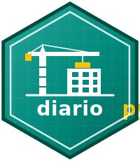

<p align="center">
  
</p>

# diariopy

[](https://github.com/StrategicProjects/diariopy/actions/workflows/ci.yml)
[](https://pypi.org/project/diariopy/)
[](https://pypi.org/project/diariopy/)
[](https://strategicprojects.github.io/diariopy/)

**diariopy** is a Python interface to the [diariodeobras.net](https://diariodeobras.net)
("Diário de Obras") platform — the Python counterpart of the R package
[`diario`](https://github.com/StrategicProjects/diario). It securely stores an API
token and wraps authenticated requests to retrieve projects, tasks, reports, and more.

> 📦 **Using R?** See the sibling package [**diario**](https://github.com/StrategicProjects/diario)
> ([CRAN](https://cran.r-project.org/package=diario) · [docs](https://strategicprojects.github.io/diario/)).

> **Disclaimer.** This package is a wrapper for the API provided by the **Diário de
> Obras** platform, which owns the data. Function and argument names are in English,
> but because the source API is in Portuguese, **response keys and some data values
> are returned in Portuguese**. Access requires a valid authentication token issued
> by the platform.

## Installation

```bash
pip install diariopy
```

## Getting started

```python
import diariopy

# 1. Store your API token securely (uses the system keyring)
diariopy.store_token("YOUR_API_TOKEN_HERE")

# 2. Confirm it was stored
diariopy.retrieve_token()

# 3. Make authenticated requests
company = diariopy.get_company()
projects = diariopy.get_projects()
```

## Usage

```python
project_id = "6717f864d163f517ae06e242"

diariopy.get_entities()                      # registered entities (cadastros)
diariopy.get_project_details(project_id)     # one project
diariopy.get_task_list(project_id)           # schedule items (cronograma)
diariopy.get_task_details(project_id, task_id)
diariopy.get_reports(project_id, limit=10, order="asc")
diariopy.get_report_details(project_id, report_id)
```

All getters return parsed JSON (Python ``dict``/``list``). Request failures raise
``diariopy.DiarioError``; invalid arguments raise ``ValueError``.

### Configuration

- **Base URL** — override with the ``DIARIO_BASE_URL`` environment variable (useful
  for staging or testing).
- **Logging** — the package logs through the ``diariopy`` logger and does not print.

## Development

```bash
uv sync --extra test      # or: pip install -e ".[test]"
uv run pytest             # tests mock the network; no token required
uv build                  # build sdist + wheel
```

## Citation

If you use **diariopy** in your work, please cite it. Citation metadata lives in
[`CITATION.cff`](CITATION.cff); GitHub renders a ready-to-use citation from it via
the "Cite this repository" button.

## License

MIT — see [LICENSE](LICENSE).
